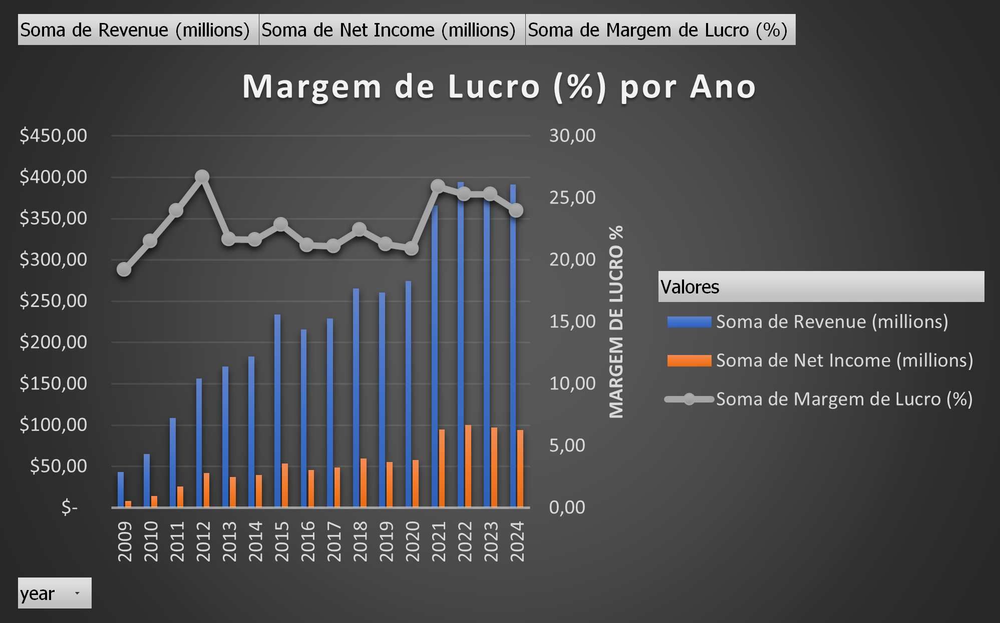

# Análise Financeira da Apple - 2024

Este repositório contém a análise financeira da Apple com base em dados históricos de receita, lucros, ativos e passivos, entre outros. Foram criados gráficos e tabelas dinâmicas para ajudar a entender a evolução financeira da empresa ao longo dos anos e os impactos dos eventos globais. A seguir, explicamos cada gráfico gerado e as tabelas dinâmicas.

---

## Gráficos e Análises

### 1. **Receita Anual Total**


**Objetivo**: Visualizar a evolução da receita anual total da Apple ao longo dos anos.  
**Insight**: A receita teve uma tendência crescente, com variações nos anos mais recentes, especialmente a partir de 2020, refletindo o impacto de novos lançamentos e a recuperação da economia global após a pandemia.

---

### 2. **Lucro Operacional e Lucro Líquido por Ano**


**Objetivo**: Comparar o lucro operacional e o lucro líquido da Apple a cada ano.  
**Insight**: O lucro operacional demonstrou crescimento estável, mas o lucro líquido apresentou flutuações, principalmente devido a fatores externos como aumento de custos e impostos mais altos em alguns anos.

---

### 3. **Caixa Disponível x Dívida por Ano**


**Objetivo**: Comparar a disponibilidade de caixa com as dívidas da Apple ao longo dos anos.  
**Insight**: A Apple manteve um caixa robusto, com o montante em caixa sempre superior às dívidas, evidenciando sua saúde financeira e capacidade de enfrentar crises financeiras.

---

### 4. **Ativos Totais vs. Passivos Totais**


**Objetivo**: Avaliar a relação entre os ativos totais e os passivos totais.  
**Insight**: A Apple apresenta ativos totais sempre superiores aos passivos, o que indica uma estrutura patrimonial sólida e a capacidade de honrar suas obrigações financeiras.

---

### 5. **Margem de Lucro (%) por Ano**


**Objetivo**: Analisar a margem de lucro da Apple ao longo do tempo, comparando o lucro líquido com a receita.  
**Insight**: A margem de lucro permaneceu relativamente estável, com pequenas variações, destacando a eficiência operacional da Apple.

---

### 6. **Evolução de Indicadores Financeiros (EBITDA, Fluxo de Caixa)**


**Objetivo**: Comparar a evolução de múltiplos indicadores financeiros da Apple, incluindo EBITDA e fluxo de caixa operacional.  
**Insight**: Ambos os indicadores mostraram um crescimento consistente, com o EBITDA refletindo um aumento nos lucros antes de impostos e o fluxo de caixa operacional indicando boa geração de caixa.

---

### 7. **Ranking de Melhores Anos por Receita**


**Objetivo**: Classificar os anos da Apple com a maior receita.  
**Insight**: Os anos mais recentes, especialmente após 2020, foram os mais lucrativos, refletindo o sucesso de novos produtos e a expansão no mercado.

---

### 8. **Participação de Ativos em Relação aos Passivos**


**Objetivo**: Analisar a estrutura de capital da Apple, verificando a participação dos ativos em relação aos passivos.  
**Insight**: A relação mostra que a Apple tem uma estrutura de capital robusta, com ativos que superam amplamente seus passivos.

---

## Tabelas Dinâmicas

Foram criadas tabelas dinâmicas para permitir uma análise mais detalhada e flexível dos dados financeiros, facilitando a visualização de padrões e insights.

### 1. **Receita Anual Total**
**Objetivo**: Somar a receita anual da Apple e avaliar sua evolução ao longo do tempo.  
**Insight**: Permite visualizar de forma clara o crescimento ou redução da receita de um ano para outro.

### 2. **Lucro Operacional e Lucro Líquido por Ano**
**Objetivo**: Comparar os lucros operacionais e líquidos a cada ano para entender a margem de lucro e a performance da empresa.  
**Insight**: A tabela dinâmica ajuda a identificar anos com maiores margens operacionais e como o lucro líquido variou devido a fatores externos.

### 3. **Caixa Disponível x Dívida por Ano**
**Objetivo**: Comparar o caixa disponível com as dívidas da Apple a cada ano, para entender sua saúde financeira.  
**Insight**: As tabelas dinâmicas destacam o montante do caixa em relação às dívidas, refletindo a capacidade de pagamento e a estabilidade financeira.

### 4. **Ativos Totais vs. Passivos Totais**
**Objetivo**: Avaliar a relação entre ativos e passivos para entender a solidez financeira da Apple.  
**Insight**: A tabela dinâmica facilita a análise de como os ativos e passivos da empresa se comportaram ao longo dos anos.

### 5. **Margem de Lucro (%) por Ano**
**Objetivo**: Calcular a margem de lucro a partir dos dados de receita e lucro líquido.  
**Insight**: A tabela dinâmica permite uma análise rápida da rentabilidade da empresa ao longo do tempo.

---

## Conclusão

Com os gráficos e tabelas dinâmicas gerados, conseguimos obter uma visão clara da saúde financeira da Apple ao longo dos anos, identificar tendências de crescimento e entender como eventos financeiros impactaram a empresa. A análise mostrou uma sólida trajetória de crescimento, com a Apple mantendo uma boa gestão de caixa, lucros consistentes e ativos superiores aos passivos.

Se tiver dúvidas ou sugestões de melhorias, fique à vontade para abrir uma **issue** ou fazer um **pull request**.

---

## Como Executar o Projeto

1. Clone o repositório:
    ```bash
    git clone https://github.com/seuusuario/apple-financial-analysis.git
    ```

2. Abra o arquivo `Analise Apple.xlsx` para visualizar as tabelas dinâmicas e gráficos.

3. Acesse as imagens nos diretórios de gráficos para visualização.

---

## Licença

Este projeto está licenciado sob a [MIT License](LICENSE).
